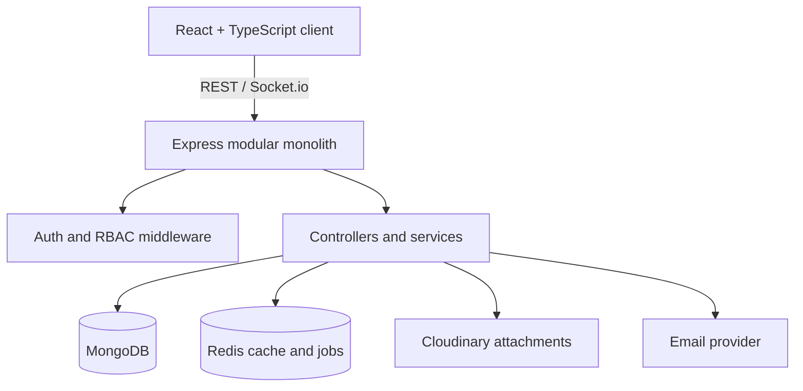

# NexusCRM

NexusCRM is a modular-monolith CRM workspace for sales teams. The current foundation includes a polished React workspace, tenant-aware lead APIs, a pipeline Kanban, and an API path ready for MongoDB and Redis-backed modules.

## Current product slice

- Executive sales overview with pipeline, activity, focus, and insight panels
- Routed workspace shell for Overview, Leads, Deals, Contacts, Companies, Activities, Analytics, and Reports
- Searchable and filterable lead table with score, owner, source, and status signals
- Deal pipeline Kanban with stage columns and probability updates
- Express API with consistent responses, Zod validation, Helmet, CORS, rate limiting, and organization scoping
- Docker Compose foundation for MongoDB, Redis, and the API

## Run locally

```bash
npm install
npm install --prefix client
npm install --prefix server
npm run dev
```

The web app runs at `http://localhost:5173` and the API at `http://localhost:4000`.

## API examples

```bash
curl http://localhost:4000/api/health
curl -H 'x-organization-id: demo-acme' http://localhost:4000/api/leads
```

Every protected resource will carry an `organizationId` scope. The current demo API uses the `x-organization-id` header as a temporary tenant boundary; JWT identity and server-side tenant middleware are the next security phase.

## Architecture



## Roadmap

1. Replace demo tenant header with JWT access and refresh cookies.
2. Add Mongoose models, repositories, indexes, and Mongo aggregation analytics.
3. Add Contacts, Companies, Activities, Tasks, Calendar, and Forecast modules.
4. Add Socket.io notifications, audit logs, uploads, email templates, tests, and CI.

Copy `.env.example` to `.env` before connecting external services. Never commit real credentials.
